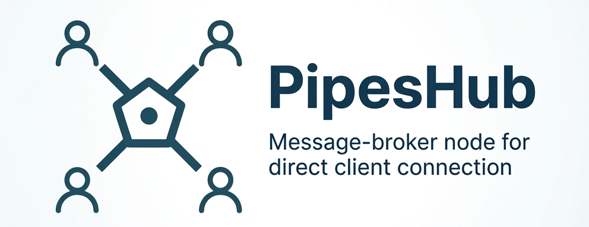

# PipesHub



NodeJS service to make other services communicate through it.

Run the server and derive a class from client. **Clients available in JavaScript, Java and Python**

- JavaScript: [PipesClientJS](https://github.com/ali-heidari/PipesClientJS)
- Python: [PipesClientPython](https://github.com/ali-heidari/PipesClientPython)
- Java: [PipesClientJava](https://github.com/ali-heidari/PipesClientJava)

## Quick overview

PipesHub provides a central hub that other services (clients) connect to. Clients authenticate via a REST API to receive a JWT, then establish a Socket.io connection to exchange messages using one of three modes:

1. request — Invoke an operation on the remote side without expecting a return.
2. ask — Invoke an operation on the remote side and wait for a response.
3. persist — Register to receive incoming messages asynchronously.

## Architecture (simple diagram)

The diagram below shows the high-level flow and components. Connect your clients to any node; the cluster will route and balance messages.

```
 +---------+        +------------------+        +------------------------+
 | ClientA | --REST-> | PipesHub (node) | --Socket-> | ClientB / Services   |
 +---------+        +------------------+        +------------------------+
                       ^     ^     ^
                       |     |     |
                  +----+-----+-----+----+
                  |  Pipeshub Cluster   |
                  |  pipeshub-1..3     |
                  +---------------------+
                           |
                        MongoDB
                   (shared registry/users)
```

- Clients first POST to the REST auth endpoint to obtain a JWT.
- Clients then connect to the Socket.io hub with the JWT in the Authorization header.
- Once connected, clients use `request`, `ask`, or `persist` modes to perform communication.

## Run with Docker Compose

The included `docker-compose.yml` runs a **3-node PipesHub cluster** where each node has an embedded [AIxKer](https://github.com/ali-heidari/AION-Agent) agent. AIxKer is an AI-driven L4 load balancer and discovery agent used for demo/self-balancing purposes.

### Requirements

- Linux kernel ≥ 5.4
- Docker with `--privileged` support (needed for eBPF/BPF syscall)

### Start the cluster

```bash
docker compose up -d --build
```

This starts:

| Service | REST (auth) | Socket.io hub | Role |
| --- | --- | --- | --- |
| `pipeshub-1` | `localhost:16916` | `localhost:3000` | Node 1 + AIxKer agent |
| `pipeshub-2` | `localhost:16917` | `localhost:3001` | Node 2 + AIxKer agent |
| `pipeshub-3` | `localhost:16918` | `localhost:3002` | Node 3 + AIxKer agent |
| `mongo` | — | — | Shared unit/user registry |

AIxKer agents discover each other automatically via UDP multicast gossip — no configuration needed. Connect your clients to any node; the cluster self-balances.

### Connect a client

Point your client at any node. Example using the REST auth endpoint on node 1:

```bash
# Get a JWT
curl -X POST http://localhost:16916/auth \
     -d "name=myservice"

# Then connect your Socket.io client to ws://localhost:3000
# with the returned token in the Authorization header
```

### Stop the cluster

```bash
docker compose down
```

> Production: For full XDP NIC-bypass performance, deploy one container per physical host using `network_mode: host`. All nodes on the same machine share one NIC, which limits XDP redirect to a single host.

## Standards

This project follows [`ai-agent-standards`](https://github.com/ali-heidari/ai-agent-standards). See [`.agent/agent-instructions.md`](.agent/agent-instructions.md) for project-specific AI agent guidance and instructions.
